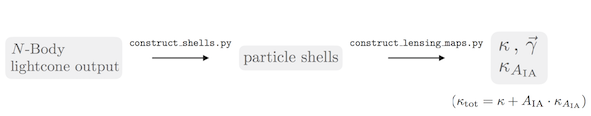

========
Usage
========

The folder /UFalcon/scripts contains some example-files, which you can use and adapt for your analysis. A sketch of the UFalcon pipeline using the example-scripts is given below:

- construct_shells.py:

    Computes and stores maps in hdf5-format containing the particle counts (shells) from N-Body simulation output. The user can choose between lightcone-output from PKDGRAV3 oder L-PICOLA.

- construct_lensing_maps.py:

    Computes convergence maps from precomputed shells in hdf5-format containing particles counts. The lensing weights require a continuous, user-specific redshift distribution or a single-source redshifts. The output consists of the convergence and the corresponding shear maps. The galaxy intrinsic alignment signal can be obtained by setting IA=1 as a parameter for the continuous lensing weights.

- config.yaml:

    Example yaml-file with parameters used to run the example-scripts.

.. literalinclude:: ../UFalcon/scripts/construct_shells.py
    :language: python

